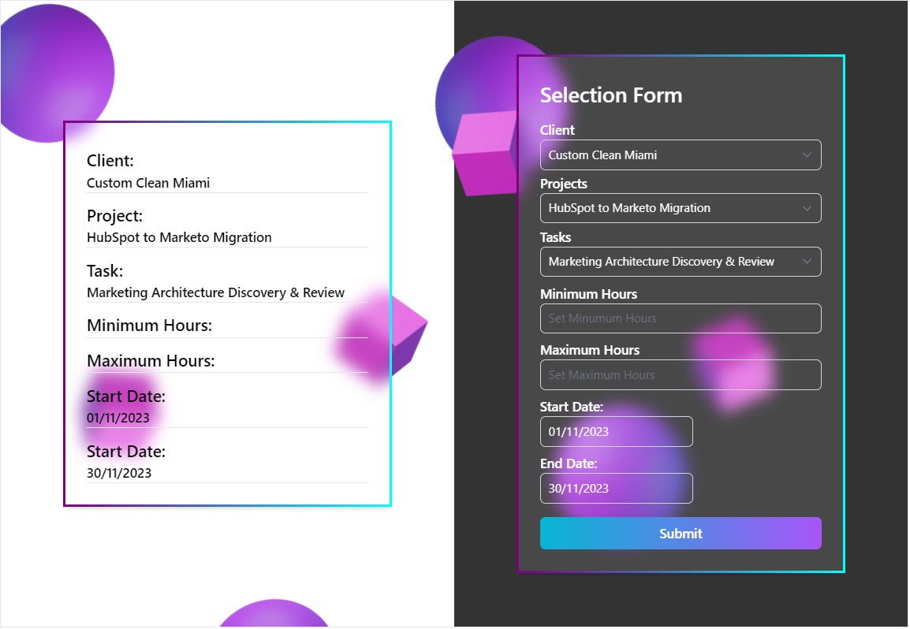

# Harvest API Data Retrieval for Further Use

This project is designed to retrieve data from the Harvest API, including information about clients, projects, and project tasks. It presents this data in a user-friendly web interface, allowing users to select clients, projects, and tasks from dropdown menus. The interface also features a date picker for selecting start and end dates, along with input fields for specifying minimum and maximum hours. A "Submit" button is provided to initiate data submission. It is important to note that the "Submit" button remains disabled until all required fields are filled out.



## Technologies Used

- **MERN Stack**: This project is built using the MERN stack, comprising MongoDB as the database, Express.js as the server framework, React for the front end, and Node.js for server-side scripting.

- **Tailwind CSS**: We used Tailwind CSS for styling the user interface, making it visually appealing and responsive.

## Features

- Retrieve data from the Harvest API for clients, projects, and project tasks.

- Populate dropdown menus dynamically based on the selected client, project, and task.

- Select start and end dates using the date picker.

- Define minimum and maximum hours using input fields.

- Enable the "Submit" button only when all required fields are filled.

- Store data in MongoDB at the backend.

## Technologies Used

- **MERN Stack**: This project is built using the MERN stack, comprising MongoDB as the database, Express.js as the server framework, React for the front end, and Node.js for server-side scripting.

- **Tailwind CSS**: We used Tailwind CSS for styling the user interface, making it visually appealing and responsive.


## Getting Started

Follow these steps to get the project up and running:

1. **Clone the Repository**: Start by cloning this repository to your local machine.

```bash
git clone https://github.com/auriaahmad/HarvestApi.git
cd <project directory>
npm install
